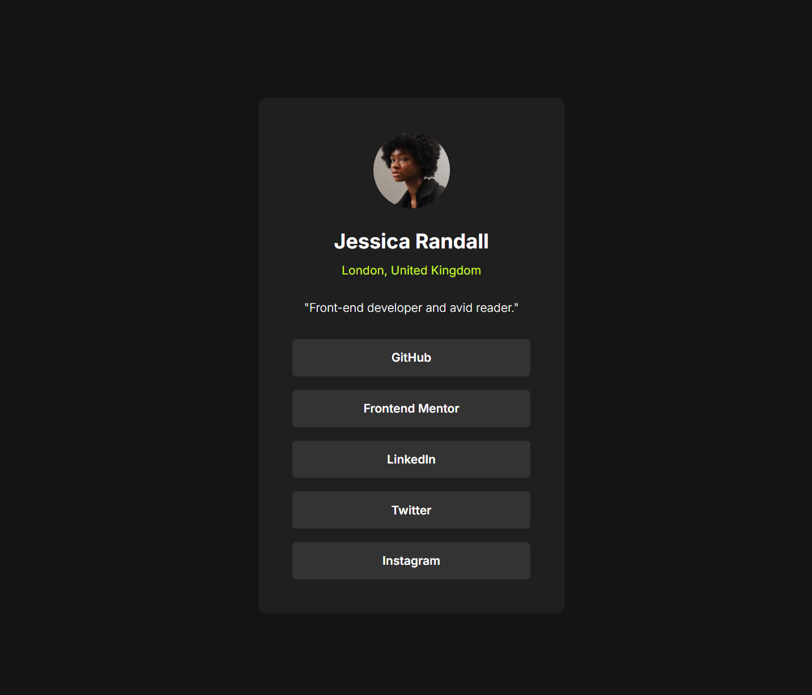

# Frontend Mentor - Social links profile solution

This is a solution to the [Social links profile challenge on Frontend Mentor](https://www.frontendmentor.io/challenges/social-links-profile-UG32l9m6dQ). Frontend Mentor challenges help you improve your coding skills by building realistic projects.

## Table of contents

- [Overview](#overview)
  - [The challenge](#the-challenge)
  - [Screenshot](#screenshot)
  - [Links](#links)
- [My process](#my-process)
  - [Built with](#built-with)
  - [What I learned](#what-i-learned)
  - [Useful resources](#useful-resources)
- [Author](#author)

## Overview

### The challenge

Users should be able to:

- See hover and focus states for all interactive elements on the page

### Screenshot



### Links

- Solution URL: [GitHub](https://github.com/Faustze/social_links_profile)
- Live Site URL: [GitHub Pages](https://faustze.github.io/social_links_profile/)

## My process

### Built with

- Semantic HTML5 markup
- CSS custom properties
- Flexbox
- Mobile-first workflow

### What I learned

During this project I worked on semantic HTML structure and CSS styling:

- **Semantic markup for links**: I learned that social links should use `<a>` tags styled as buttons, not `<button>` wrapped around `<a>`. Links are for navigation, buttons are for actions on the current page.

- **Using `<ul>` for link lists**: A list of social links is semantically a list, so `<ul>` with `<li>` is more appropriate than generic `<div>` or `<section>` wrappers.

- **List reset styles**: I practiced removing default browser styling from lists (`list-style: none`, `padding: 0`, `margin: 0`) and links (`text-decoration: none`).

```css
/* LIST RESET */
.main__links {
  list-style: none;
  padding: 0;
  margin: 0;
  display: flex;
  flex-direction: column;
  gap: 1rem;
}

.main__link {
  display: block;
  text-decoration: none;
  color: var(--white);
}
```

- **Flexbox for centering**: Using `display: flex` with `align-items: center` and `justify-content: center` on the wrapper to center the card both horizontally and vertically.

### Useful resources

- [MDN — CSS list-style](https://developer.mozilla.org/en-US/docs/Web/CSS/list-style) — helped me understand how to properly reset list styles.
- [MDN — Styling links](https://developer.mozilla.org/en-US/docs/Learn/CSS/Styling_text/Styling_links) — a good reference for link styling best practices.

## Author

- Frontend Mentor - [@Faustze](https://www.frontendmentor.io/profile/Faustze)
